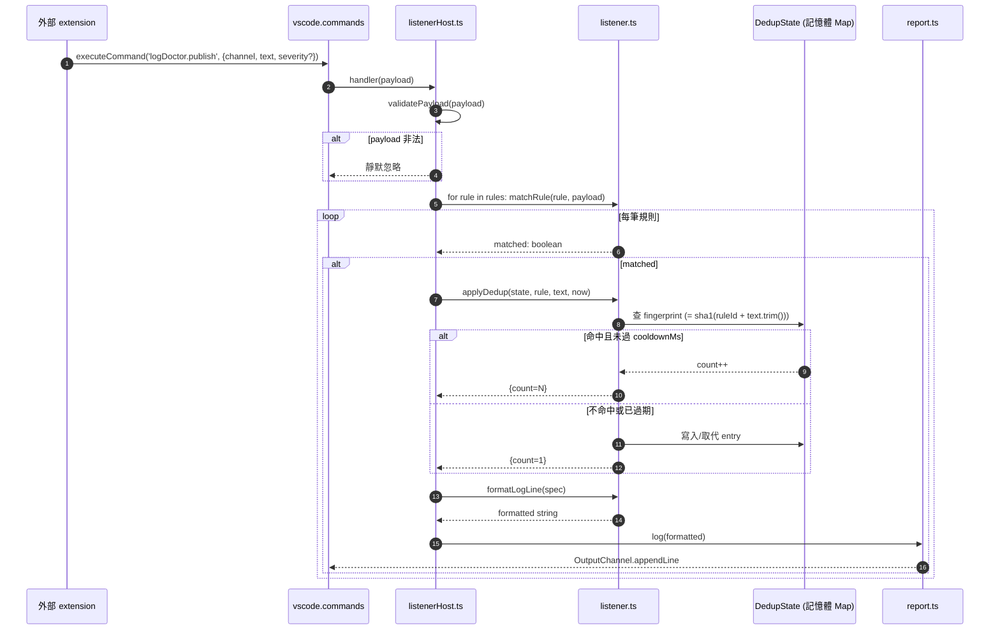

# VS Code 多功能套件實驗專案 (VS Code Extension Experiment)

本專案以單一 VS Code extension 承載多個獨立功能模組。目前包含自動診斷修復的
`Log Doctor`，以及把 Codex／Claude 終端 TUI 或一般 Markdown 檔中的 Mermaid 圖
轉成可點擊預覽的 `Mermaid TUI Preview`。

## 專案結構 (Project Structure)

root `package.json` 是唯一的 extension manifest；各功能模組透過
`register*()` 接到 root `src/extension.ts`，不各自建立 extension package。

```
vscode-plugin-experiment/
├── package.json                  # 唯一 extension manifest 與 npm 入口
├── src/extension.ts              # root orchestrator
├── log_doctor/                   # LLM 診斷修復功能
│   ├── src/
│   └── test/
├── mermaid_tui_preview/          # Codex／Claude TUI Mermaid 互動式預覽
│   ├── src/
│   ├── test/
│   ├── webview/
│   └── CLAUDE.md
└── docs/superpowers/plans/       # 跨模組實作計畫
```

## 插件功能測試索引 (Plugin Feature Index)

| # | 插件名稱 | 子資料夾 | 功能描述 | 狀態 |
|---|----------|---------|---------|------|
| 1 | Log Doctor | `log_doctor/` | 讀取 VSCode 診斷，以 LLM 自動修復 | ✅ Active |
| 2 | Mermaid TUI Preview | `mermaid_tui_preview/` | 擷取 TUI 或 Markdown `mermaid` code block 並提供可拖曳預覽 | Experimental |

## Mermaid TUI Preview

### 前置需求 (Prerequisites)

- VS Code 或相容 IDE `1.93+`
- integrated terminal 的 `shell integration` 已啟用（僅 TUI 偵測需要）

### 使用流程 (Usage Flow)

`````text
Codex／Claude TUI raw output
  → TerminalShellExecution.read()
  → headless terminal 畫面重建
  → Mermaid 區塊偵測
  → terminal link
  → 內建 Mermaid webview
  → 左鍵拖曳／滾輪縮放

一般 Markdown 檔：

````text
Markdown ```mermaid code block
  → mermaid marker 的文件連結或 Markdown command
  → 內建 Mermaid webview
````
`````

1. 安裝本 extension 後重新載入 IDE。
2. 在 integrated terminal 啟動 `codex`、`claudem`、`claude` 或
   `claude-code`。
3. 當回答出現 Mermaid 圖時：
   - Codex／Claude TUI：按住 `Cmd` 並點擊 `flowchart`、
     `sequenceDiagram` 等圖型指令。
   - Claude TUI 額外顯示可點擊的 `mermaid` marker；Codex TUI 不顯示此 marker。
   - 若同一個 terminal 有多張圖使用完全相同的 directive header，點擊時直接開啟
     最近更新的一張，不顯示圖表選單。
4. 也可從 Command Palette 執行
   `Mermaid TUI Preview: Open Latest Diagram`，開啟目前 terminal 最新偵測到的圖。
5. 預覽開啟後，按住滑鼠左鍵拖曳圖表；使用滾輪或右上角按鈕進行 SVG
   `viewBox` 縮放與重設。預覽會保留原始 Mermaid source，包括 label 內的 `<br/>`。
6. 一般 `.md` 檔可直接加入：

   ````markdown
   ```mermaid
   flowchart TD
     A[Start] --> B[Done]
   ```
   ````

   點擊開頭的 `mermaid` 標記即可開啟預覽；也可將游標放在區塊內，執行
   `Mermaid TUI Preview: Open Markdown Diagram`。

`Codex 與 Claude 的顯示差異：`

| TUI | 畫面上的起始行 | detector 路徑 |
| --- | -------------- | ------------- |
| Claude | `⏺ mermaid` | 由 marker 取得後續縮排區塊 |
| Codex | `• flowchart TD` | 直接辨識 Mermaid 圖型指令 |

圖型指令對齊套件內建 Mermaid `11.16` renderer，支援
`classDiagram-v2`、`flowchart-elk`、`architecture`、`treemap` 等 aliases。
每個 terminal 依真正更新順序保留最近 `20` 張圖；相同 header 的不同圖不會互相覆寫。

此功能不回讀既有 terminal scrollback，只監聽 extension 啟動後、具備 shell
integration 的新 command execution。技術細節見
[mermaid_tui_preview/CLAUDE.md](./mermaid_tui_preview/CLAUDE.md)。

---

## Log Doctor 0.3.0 Output Channel Listener 流程 (Flow)

`logDoctor.publish` 是 `log_doctor` 對外開放的命令承載點;其他擴充功能透過 `vscode.commands.executeCommand('logDoctor.publish', payload)` 把訊息推播進來,Log Doctor 依 `logDoctor.listeners` 設定中的 regex 規則過濾,匹配後寫入 `Log Doctor` Output channel,同源訊息會在 `cooldownMs` 視窗內聚合顯示為 `(×N)`。

### 訊息時序圖 (Sequence Diagram)



### 端對端時序屬性 (Timing Properties)

| 屬性                        | 數值 / 說明                                                                                           |
| --------------------------- | ----------------------------------------------------------------------------------------------------- |
| 延遲 (publish → appendLine) | 同步,單筆 < 5 毫秒 (regex + Map 查詢)                                                                 |
| 同步性                      | `registerCommand` handler 為非同步安全 (async-safe);`applyDedup` 內部 Map 操作單執行緒無需上鎖 (lock) |
| 順序保證                    | 同一 channel 內 FIFO;跨 channel 不保證                                                                |
| 重啟後行為                  | 記憶體 dedup state 清空;重啟前已收過的 fingerprint 會重新以 `count=1` 寫入                            |

### 同源去重 (Deduplication) 指紋 (Fingerprint) 規則

```
fingerprint = sha1(ruleId + '\n' + text.trim()).slice(0, 12)
```

- `ruleId` 確保「同一行文字被兩個規則匹配」會各自獨立計數
- `text.trim()` 把行尾空白差異視為同一筆
- sha1 僅作短碼用途,無安全意涵

### 冷卻 (Cooldown) 邊界行為

| 時刻              | 事件                  | channel 輸出                     |
| ----------------- | --------------------- | -------------------------------- |
| `T0`              | 首次同 fingerprint    | `... error message`              |
| `T0 + 60s`        | 同 fingerprint 再進來 | `... error message (×2)`         |
| `T0 + cooldownMs` | 同 fingerprint 再進來 | 視為新事件,從 `count=1` 重新計數 |

`applyDedup` 內會順手驅逐 (evict) 所有 `lastSeen < now - maxCooldown` 的條目,避免 Map 無限成長。

### 多筆規則同時匹配

- 一行可能同時命中多筆規則(例如「嚴重錯誤」與「含 stack trace」兩條)
- 每筆規則各自走一次 `applyDedup` — 因為 `ruleId` 不同,fingerprint 也不同,**channel 內可能出現兩行**
- 使用者若不想重複,自行避免 pattern 重疊即可

### 整合範例 (使用者端 .vscode/settings.json)

```jsonc
{
    "logDoctor.listeners": [
        {
            "id": "eslint-warn",
            "channel": "ESLint*",
            "pattern": "warning",
            "label": "ESLint Warning",
            "cooldownMs": 120000
        },
        {
            "id": "tsc-error",
            "channel": "TypeScript*",
            "pattern": "^error TS\\d+:",
            "label": "tsc Error"
        }
    ]
}
```

---

## 打包與安裝 (Packaging & Installation)

### 打包 (Package)

```bash
cd vscode-plugin-experiment
npm run package
```

`vscode:prepublish` 會先執行完整 build，避免把舊的 `out/src/extension.js`
包進 VSIX。成功後產生 `vscode-plugin-experiment-0.4.0.vsix`。

### 安裝 (Install)

```bash
npm run install:antigravity
```

安裝 task 只會安裝 `package.json` 對應的精確版本，不使用 `*.vsix`。完成後在
Antigravity IDE 執行 `Developer: Reload Window`，再於 integrated terminal
啟動新的 `codex`、`claudem`、`claude` 或 `claude-code` command；既有 TUI
與 extension 啟動前的
scrollback 不會被回溯擷取。

### 解除安裝 (Uninstall)

```bash
agy-ide --uninstall-extension shuk.vscode-plugin-experiment
```

套件識別碼 (Extension ID) 格式為 `{publisher}.{name}`。

---

## 發佈至套件市集 (Publishing to Registries)

要發佈套件，主要有兩個主要平台：

### 1. 視覺化工作室代碼套件市集 (Visual Studio Code Marketplace)

這是官方主要的發佈平台。詳細發佈說明請參閱官方文件：[Publishing Extensions](https://code.visualstudio.com/api/working-with-extensions/publishing-extension)。

### 2. 開放視覺化工作室套件市集 (Open VSX Registry)

開放視覺化工作室套件市集 (Open VSX Registry) 是 Eclipse 基金會提供的開源套件市集，相容於各種開源版 IDE（如 VSCodium）。

- 步驟 `A`: 註冊 [Eclipse 基金會帳戶](https://open-vsx.org/user-settings/extensions)。
- 步驟 `B`: 在帳戶設定中建立發佈者名稱並產生存取權杖 (Access Token)。
- 步驟 `C`: 使用套件發佈工具進行發佈：

    ```bash
    npx ovsx publish vscode-plugin-experiment-0.4.0.vsix -t <your-openvsix-token>
    ```

    或者可以登入後發佈：

    ```bash
    npx ovsx login -t <your-openvsix-token>
    npx ovsx publish
    ```
