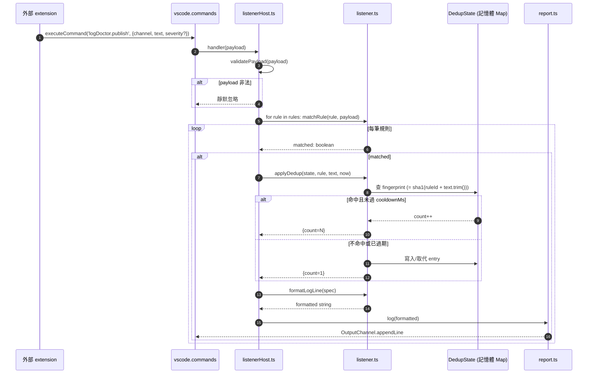

# 視覺化工作室代碼套件實驗專案 (VS Code Extension Experiment Project)

本專案是一個用於開發與實驗視覺化工作室代碼 (Visual Studio Code) 套件的儲存庫。本文件說明如何建置、安裝、解除安裝此套件，以及如何發佈至套件市集。

## 專案結構 (Project Structure)

每個子資料夾為一個獨立插件功能測試。

```
vscode-plugin-experiment/
├── README.md                 # 本文件
├── CLAUDE.md                 # 技術脈絡
├── package.json              # 根層無意義，僅為子模組存在
│
├── log_doctor/               # [Plugin Feature 1] LLM 自動修復診斷
│   ├── src/
│   │   ├── extension.ts      # 進入點與命令註冊
│   │   ├── listener.ts       # regex 匹配 + 同源去重 (0.3.0+)
│   │   ├── listenerHost.ts   # logDoctor.publish 命令處理
│   │   ├── report.ts         # Output channel 報告器
│   │   ├── providers/        # Claude / OpenAI provider 實作
│   │   └── ...               # 收集、風控、修補、驗證模組
│   └── package.json          # 擴充功能 manifest
│
└── plans/                    # 規劃文件存放區
```

## 插件功能測試索引 (Plugin Feature Index)

| # | 插件名稱 | 子資料夾 | 功能描述 | 狀態 |
|---|----------|---------|---------|------|
| 1 | Log Doctor | `log_doctor/` | 讀取 VSCode 診斷，以 LLM 自動修復 | ✅ Active |

> 未來新插件功能測試以此格式擴充：每個插件一個子資料夾，獨立 `package.json`、獨立建置流程。

---

## Log Doctor 0.3.0 Output Channel Listener 流程 (Flow)

`logDoctor.publish` 是 `log_doctor` 對外開放的命令承載點;其他擴充功能透過 `vscode.commands.executeCommand('logDoctor.publish', payload)` 把訊息推播進來,Log Doctor 依 `logDoctor.listeners` 設定中的 regex 規則過濾,匹配後寫入 `Log Doctor` Output channel,同源訊息會在 `cooldownMs` 視窗內聚合顯示為 `(×N)`。

### 訊息時序圖 (Sequence Diagram)



### 端對端時序屬性 (Timing Properties)

| 屬性                        | 數值 / 說明                                                                                           |
| --------------------------- | ----------------------------------------------------------------------------------------------------- |
| 延遲 (publish → appendLine) | 同步,單筆 < 5 毫秒 (regex + Map 查詢)                                                                 |
| 同步性                      | `registerCommand` handler 為非同步安全 (async-safe);`applyDedup` 內部 Map 操作單執行緒無需上鎖 (lock) |
| 順序保證                    | 同一 channel 內 FIFO;跨 channel 不保證                                                                |
| 重啟後行為                  | 記憶體 dedup state 清空;重啟前已收過的 fingerprint 會重新以 `count=1` 寫入                            |

### 同源去重 (Deduplication) 指紋 (Fingerprint) 規則

```
fingerprint = sha1(ruleId + '\n' + text.trim()).slice(0, 12)
```

- `ruleId` 確保「同一行文字被兩個規則匹配」會各自獨立計數
- `text.trim()` 把行尾空白差異視為同一筆
- sha1 僅作短碼用途,無安全意涵

### 冷卻 (Cooldown) 邊界行為

| 時刻              | 事件                  | channel 輸出                     |
| ----------------- | --------------------- | -------------------------------- |
| `T0`              | 首次同 fingerprint    | `... error message`              |
| `T0 + 60s`        | 同 fingerprint 再進來 | `... error message (×2)`         |
| `T0 + cooldownMs` | 同 fingerprint 再進來 | 視為新事件,從 `count=1` 重新計數 |

`applyDedup` 內會順手驅逐 (evict) 所有 `lastSeen < now - maxCooldown` 的條目,避免 Map 無限成長。

### 多筆規則同時匹配

- 一行可能同時命中多筆規則(例如「嚴重錯誤」與「含 stack trace」兩條)
- 每筆規則各自走一次 `applyDedup` — 因為 `ruleId` 不同,fingerprint 也不同,**channel 內可能出現兩行**
- 使用者若不想重複,自行避免 pattern 重疊即可

### 整合範例 (使用者端 .vscode/settings.json)

```jsonc
{
    "logDoctor.listeners": [
        {
            "id": "eslint-warn",
            "channel": "ESLint*",
            "pattern": "warning",
            "label": "ESLint Warning",
            "cooldownMs": 120000
        },
        {
            "id": "tsc-error",
            "channel": "TypeScript*",
            "pattern": "^error TS\\d+:",
            "label": "tsc Error"
        }
    ]
}
```

---

## 打包與安裝 (Packaging & Installation)

### 打包 (Package)

```bash
cd vscode-plugin-experiment
npx @vscode/vsce package
```

打包前確認 [package.json](./package.json) 已設定 `publisher`、`repository`、`license` 欄位，否則打包會失敗。成功後產生 `vscode-plugin-experiment-0.3.0.vsix`。

### 安裝 (Install)

```bash
agy-ide --install-extension vscode-plugin-experiment-0.3.0.vsix
```

### 解除安裝 (Uninstall)

```bash
agy-ide --uninstall-extension shuk.vscode-plugin-experiment
```

套件識別碼 (Extension ID) 格式為 `{publisher}.{name}`。

---

## 發佈至套件市集 (Publishing to Registries)

要發佈套件，主要有兩個主要平台：

### 1. 視覺化工作室代碼套件市集 (Visual Studio Code Marketplace)

這是官方主要的發佈平台。詳細發佈說明請參閱官方文件：[Publishing Extensions](https://code.visualstudio.com/api/working-with-extensions/publishing-extension)。

### 2. 開放視覺化工作室套件市集 (Open VSX Registry)

開放視覺化工作室套件市集 (Open VSX Registry) 是 Eclipse 基金會提供的開源套件市集，相容於各種開源版 IDE（如 VSCodium）。

- 步驟 `A`: 註冊 [Eclipse 基金會帳戶](https://open-vsx.org/user-settings/extensions)。
- 步驟 `B`: 在帳戶設定中建立發佈者名稱並產生存取權杖 (Access Token)。
- 步驟 `C`: 使用套件發佈工具進行發佈：

    ```bash
    npx ovsx publish vscode-plugin-experiment-0.3.0.vsix -t <your-openvsix-token>
    ```

    或者可以登入後發佈：

    ```bash
    npx ovsx login -t <your-openvsix-token>
    npx ovsx publish
    ```
