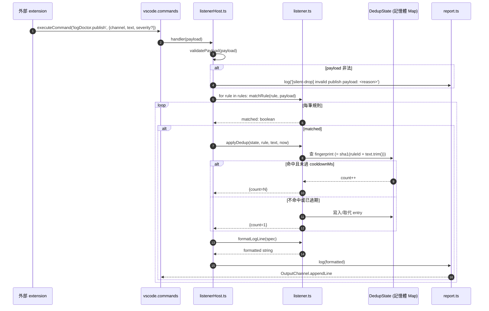

# `log_doctor` 0.3.0 Output Channel Listener 設計 (Output Channel Listener Design for log_doctor 0.3.0)

`log_doctor` 0.3.0 新增「Output Channel Listener」功能:開放 `logDoctor.publish` 命令承載點,讓其他擴充功能把訊息推播進來,依 `logDoctor.listeners` 設定中的 regex 規則過濾,匹配後寫入 `Log Doctor` channel;同源訊息會在 `cooldownMs` 視窗內聚合顯示為 `(×N)`。

## 設計目標與非目標 (Goals & Non-Goals)

### 目標 (Goals)

- 提供一個**通用的 regex 訊號監聽介面**,不限特定工具
- **只記錄到 `Log Doctor` channel** — 不走既有 `fixWorkspace` 的 AI fix pipeline、不跳通知
- 設定完全靠 `settings.json`(`logDoctor.listeners`),無新命令、無 UI
- 跨擴充功能的訊號源採**發布者命令契約 (Publisher Command Contract)**:Log Doctor 開 `logDoctor.publish`,其他擴充主動呼叫
- 抗爆設計:**同源去重 + 計數**,避免 channel 被單一事件沖爆

### 非目標 (Non-Goals)

- 不取代 LSP (Language Server Protocol) 診斷收集(`vscode.languages.getDiagnostics`)
- 不直接監聽 VSCode `OutputChannel` 的 append 事件(API 限制,該事件未對外暴露)
- 不引入新的 Provider / LLM 呼叫
- 不動既有 `report.ts` / `extension.ts` / `fixer.ts` / `applier.ts` / `verifier.ts`
- 不做事件持久化(重啟後 dedup state 清空是 feature 不是 bug)

## 架構 (Architecture)

新增 2 個檔案,**完全 additive**,不動既有模組:

```
log_doctor/src/
├── listener.ts          # 純:規則載入 + regex 匹配 + fingerprint + dedup window
└── listenerHost.ts      # vscode 邊界:註冊 logDoctor.publish,介接 report.ts
```

依賴方向:

```
extension.ts (activate)
   │
   ├─▶ registerCommand('logDoctor.showOutput'...)      (既有)
   ├─▶ registerCommand('logDoctor.fixWorkspace'...)   (既有)
   └─▶ listenerHost.activateListener(context, cfg)     ← 新增

listenerHost.activateListener
   │
   ├─▶ vscode.commands.registerCommand('logDoctor.publish', handler)
   └─▶ handler → listener.processEvent(payload, rules, dedup)
                      │
                      └─▶ report.log(formatted)        (既有,不動)
```

邊界紀律:

- `listener.ts` 不 import `vscode`,可在純 Node 直接測
- `listenerHost.ts` 是唯一的 vscode 邊界,職責單純(註冊命令、把 payload 丟給純邏輯、最後 `appendLine`)
- `extension.ts` 改動極小:`activateListener` 加在既有 `context.subscriptions.push(...)` 區塊後,並包進既有 try/catch

## 元件介面與型別 (Components & Types)

### `src/types.ts` 新增型別

```ts
// 規則 schema (對應 settings.json)
export interface ListenerRule {
  id: string;             // 規則唯一識別,fingerprint 用
  channel: string;        // channel 名,支援 glob (例如 'ESLint*')
  pattern: string;        // regex 字串,匹配整行
  label?: string;         // 顯示用 label,預設用 id
  cooldownMs?: number;    // dedup 視窗,預設 300000 (5 分鐘)
}

// publisher 命令承載
export interface PublishPayload {
  channel: string;        // channel 名
  text: string;           // 一行訊息
  severity?: 'info' | 'warn' | 'error';  // 選填,只影響 label 前綴
}

// 內部 dedup 狀態
export interface DedupEntry {
  fingerprint: string;    // = sha1(ruleId + '\n' + text.trim()).slice(0, 12)
  count: number;          // 累積次數
  firstSeen: number;      // epoch ms
  lastSeen: number;       // epoch ms
  sampleText: string;     // 第一筆的原文
  rule: ListenerRule;     // 反查規則
}

// 對外吐出的「要寫進 channel 的一行」
export interface LogLineSpec {
  channel: string;        // 來源 channel
  label: string;          // 規則 label
  severity?: 'info' | 'warn' | 'error';
  text: string;           // 原始或 sample text
  count: number;          // 1 = 首次,>1 = 聚合
}
```

`ConfigSnapshot` 介面新增欄位:

```ts
export interface ConfigSnapshot {
  // ... 既有欄位
  listeners: ListenerRule[];
}
```

### `src/listener.ts` 純模組(不 import `vscode`)

| 函式 | 簽名 | 職責 |
| --- | --- | --- |
| `loadRules` | `(cfg: ListenerRule[]) => { rules: ListenerRule[]; warnings: string[] }` | 套預設值、編譯 regex、驗證 id 唯一、為缺 `label` 的 rule 補 `label = id`,回傳有效規則與警告 |
| `matchRule` | `(rule: ListenerRule, payload: PublishPayload) => boolean` | channel glob 匹配(`*` 萬用字元,大小寫敏感) + regex 匹配(忽略大小寫由 regex 內 `(?i)` 自控) |
| `fingerprint` | `(rule: ListenerRule, text: string) => string` | `sha1(ruleId + '\n' + text.trim()).slice(0, 12)`,用 `node:crypto.createHash` |
| `newDedupState` | `() => DedupState` | 空 `Map<fingerprint, DedupEntry>` |
| `applyDedup` | `(state, rule, text, now) => { line: LogLineSpec; evicted: number }` | 命中 + 未過期 → count++;過期或不命中 → 新增/取代;回傳 line 與清除條目數 |
| `formatLogLine` | `(spec: LogLineSpec) => string` | `格式: [<iso>] [<severity?>] <label>@<channel>: <text>[ (×N)]` |

### `src/listenerHost.ts`(vscode 邊界)

```ts
export function activateListener(
  context: vscode.ExtensionContext,
  cfg: ConfigSnapshot,
): void
```

職責:

1. 讀 `cfg.listeners`,透過 `loadRules` 取得有效規則與警告,警告逐行 `report.log`
2. 啟動 `DedupState`(記憶體 Map)
3. `registerCommand('logDoctor.publish', handler)`,handler:
   - `validatePayload(payload)` — 非 object、缺欄位、型別錯 → 寫進 channel 帶 `[silent-drop] invalid publish payload: <reason>` prefix;`<reason>` 為下列其一:`payload is not an object`、`missing 'channel'`、`missing 'text'`、`'channel' is not a string`、`'text' is not a string`、`'text' exceeds 10 KB (got X, truncated)`、`unknown severity 'Y', dropped`
   - 對每筆 rule 跑 `matchRule`,命中 → `applyDedup` → `formatLogLine` → `report.log`
4. `context.subscriptions.push(dispose)`

### `src/extension.ts` 改動(僅 +5 行)

```ts
// 在既有 context.subscriptions.push(...) 區塊後:
try {
  listenerHost.activateListener(context, cfg);
} catch (e) {
  reportLog(`Log Doctor: listener init failed: ${(e as Error).message}; fixWorkspace 仍可用`);
}
```

listener 不依賴 queue、不依賴 scheduler、不呼叫 LLM。即使 listener 完全壞掉,`fixWorkspace` / `setApiKey` / `showOutput` 三條命令都不受影響。

## 資料流 (Data Flow)

從「外部 extension 觸發 publish」到「Log Doctor channel 出現一行」的時序:



### 端對端時序屬性

| 屬性 | 數值 / 說明 |
| --- | --- |
| 延遲 (publish → appendLine) | 同步,單筆 < 5 毫秒(regex + Map 查詢) |
| 同步性 | `registerCommand` handler 為非同步安全 (async-safe);`applyDedup` 內部 Map 操作單執行緒無需上鎖 (lock) |
| 順序保證 | 同一 channel 內 FIFO;跨 channel 不保證 |
| 重啟後行為 | 記憶體 dedup state 清空;重啟前已收過的 fingerprint 會重新以 `count=1` 寫入 |

### 同源去重指紋規則

```
fingerprint = sha1(ruleId + '\n' + text.trim()).slice(0, 12)
```

- `ruleId` 確保「同一行文字被兩個規則匹配」會各自獨立計數
- `text.trim()` 把行尾空白差異視為同一筆
- sha1 僅作短碼用途,無安全意涵

### 冷卻 (Cooldown) 邊界行為

| 時刻 | 事件 | channel 輸出 |
| --- | --- | --- |
| `T0` | 首次同 fingerprint | `... error message` |
| `T0 + 60s` | 同 fingerprint 再進來 | `... error message (×2)` |
| `T0 + cooldownMs` | 同 fingerprint 再進來 | 視為新事件,從 `count=1` 重新計數 |

`applyDedup` 內會順手驅逐 (evict) 所有 `lastSeen < now - maxCooldown` 的條目,避免 Map 無限成長。

### 多筆規則同時匹配

- 一行可能同時命中多筆規則(例如「嚴重錯誤」與「含 stack trace」兩條)
- 每筆規則各自走一次 `applyDedup` — 因為 `ruleId` 不同,fingerprint 也不同,**channel 內可能出現兩行**
- 使用者若不想重複,自行避免 pattern 重疊即可

## 設定 Schema (Settings)

### `package.json` 的 `contributes.configuration.properties` 新增

```jsonc
"logDoctor.listeners": {
  "type": "array",
  "default": [],
  "markdownDescription": "Regex 規則,匹配外部 extension 推播到 `logDoctor.publish` 的訊息。命中時 append 到 **Log Doctor** channel;同源訊息在 cooldownMs 內會聚合顯示為 `(×N)`。",
  "items": {
    "type": "object",
    "required": ["id", "channel", "pattern"],
    "properties": {
      "id": {
        "type": "string",
        "pattern": "^[a-zA-Z0-9_-]+$",
        "description": "規則識別,fingerprint 與 dedup 用,必須唯一。"
      },
      "channel": {
        "type": "string",
        "description": "要訂閱的 channel 名,支援 glob (`*` 匹配任意字元,例如 `ESLint*`、`Jest*`)。"
      },
      "pattern": {
        "type": "string",
        "format": "regex",
        "description": "regex 字串,匹配整行 `text`。`(?i)` 前綴可開 case-insensitive。"
      },
      "label": {
        "type": "string",
        "description": "channel 顯示用 label。省略時用 id。"
      },
      "cooldownMs": {
        "type": "number",
        "minimum": 1000,
        "default": 300000,
        "description": "同 fingerprint 訊息聚合視窗(毫秒)。過期視為新事件。"
      }
    },
    "additionalProperties": false
  }
}
```

預設值:空陣列。沒設過 `logDoctor.listeners` 的使用者,listenerHost 仍會註冊 `logDoctor.publish` 命令,只是 matchRule 沒規則命中 — 等同無作用。

### 整合範例(使用者端 `.vscode/settings.json`)

```jsonc
{
  "logDoctor.listeners": [
    {
      "id": "eslint-warn",
      "channel": "ESLint*",
      "pattern": "warning",
      "label": "ESLint Warning",
      "cooldownMs": 120000
    },
    {
      "id": "tsc-error",
      "channel": "TypeScript*",
      "pattern": "^error TS\\d+:",
      "label": "tsc Error"
    }
  ]
}
```

### Schema 驗證(`loadRules` 內部)

| 檢查 | 失敗行為 |
| --- | --- |
| 缺 `id` / `channel` / `pattern` | 跳過該筆,`report.log` 一行 warn |
| `id` 重複(同一份 listeners 內) | 跳過後出現的那筆,`report.log` 一行 warn |
| regex 編譯失敗 | 跳過該筆,`report.log` 一行 warn(含原始 pattern) |
| `cooldownMs` 非 number 或 < 1000 | 強制改 300000,`report.log` 一行 warn |
| `id` 不符合 `[a-zA-Z0-9_-]+` | 跳過該筆,`report.log` 一行 warn |

schema 驗證**不 throw** — listener 設計失敗時整個 extension 不能掛。

## 錯誤處理 (Error Handling)

Listener 設計原則:**絕不讓 listener 失敗影響 `fixWorkspace` 或其他命令**。所有錯誤路徑都 `report.log` 一行 warn,然後 return。

### 失敗模式清單與處置

| 失敗模式 | 觸發點 | 處置 | 給誰看 |
| --- | --- | --- | --- |
| payload 不是 object | `validatePayload` | 寫進 channel 帶 `[silent-drop] invalid publish payload: <reason>` | Log Doctor channel |
| payload 缺 `channel` / `text` | `validatePayload` | 同上 | Log Doctor channel |
| `channel` / `text` 不是 string | `validatePayload` | 同上 | Log Doctor channel |
| `text` 長度 > 10 KB | `validatePayload` | 截斷到 10 KB 後繼續 | Log Doctor channel |
| `severity` 非合法值 | `validatePayload` | 忽略該欄位,當未填 | 無 |
| rule 缺 `id` / `channel` / `pattern` | `loadRules` | 跳過該筆,`report.log` warn | Log Doctor channel |
| rule `id` 重複 | `loadRules` | 保留第一筆,跳過後續 | Log Doctor channel |
| rule `pattern` regex 編譯失敗 | `loadRules` | 跳過該筆,`report.log` warn 含原始 pattern | Log Doctor channel |
| rule `cooldownMs` < 1000 或非數字 | `loadRules` | 強制 300000,`report.log` warn | Log Doctor channel |
| rule `id` 不符合 `[a-zA-Z0-9_-]+` | `loadRules` | 跳過該筆,`report.log` warn | Log Doctor channel |
| dedup Map `entries.size` 在新增前 ≥ 10000 | `applyDedup` 內 evict | 觸發一次大掃,把 `lastSeen < now - maxCooldown` 全清,然後才寫入新 entry | 無 |
| `sha1` / regex 內部 throw | matcher 內 | 視為不命中,繼續跑下一條 rule | Log Doctor channel(debug 等級) |

### 為什麼 payload 失敗要寫進 channel 帶 prefix?

publisher 命令是**外部任意擴充**呼叫,一個寫錯的呼叫方不能讓 Log Doctor 整個 listener 失效。寫進 channel 帶 `[silent-drop]` prefix = 「呼叫方把訊息丟進黑洞,但 Log Doctor 仍健康,並留下除錯線索」。這是給想除錯的擴充作者一個 hint,而不影響正常使用者體驗。

### 為什麼 dedup Map 要有 10000 上限?

理論上 `fingerprint` 是 `ruleId + text.trim()` 的 sha1 前 12 字 — 空間夠大,**不會撞 key**。但若外部擴充每秒送 1000 筆 unique text,Map 一小時就 3.6M 條目。10000 上限 + 自動 evict 給一個**安全網**,正常使用者根本碰不到。

> 效能備註:1M 條目 `Map` 的 `get` / `set` 是 O(1) hash,但 GC (Garbage Collection) pressure 高。10000 是保守值,實測可調。

## 測試策略 (Testing)

延續既有慣例:`listener.ts` 純模組走 Vitest 直接測;`listenerHost.ts` 是 vscode 邊界,不寫單元測試(跟 `extension.ts` 同 — 已被 `vitest.config.ts` 排除於 coverage)。

### 純模組測試 — `test/listener.test.ts`(新增)

| Test # | 案例 | 斷言 |
| --- | --- | --- |
| 1 | `matchRule`: channel 完全相等 | 命中 |
| 2 | `matchRule`: channel glob `ESLint*` 匹配 `ESLint Server` | 命中 |
| 3 | `matchRule`: channel glob `ESLint*` 不匹配 `Jest Output` | 不命中 |
| 4 | `matchRule`: regex `^error` 匹配 `error TS1234: ...` | 命中 |
| 5 | `matchRule`: regex `^error` 不匹配 `Type error` | 不命中 |
| 6 | `matchRule`: regex `(?i)warning` 大小寫不敏感匹配 | 命中 |
| 7 | `fingerprint`: 同 ruleId + 同 text | 相同 hash |
| 8 | `fingerprint`: 同 ruleId + text 行尾空白不同 | 相同 hash(`trim`) |
| 9 | `fingerprint`: 不同 ruleId + 同 text | 不同 hash |
| 10 | `loadRules`: 合法 2 筆 | 2 筆過、regex 預編譯 |
| 11 | `loadRules`: 缺 `id` | 該筆跳過、`warnings` 陣列含 1 筆 |
| 12 | `loadRules`: 缺 `channel` | 該筆跳過 |
| 13 | `loadRules`: 缺 `pattern` | 該筆跳過 |
| 14 | `loadRules`: `pattern` regex 編譯失敗 | 該筆跳過、`warnings` 內含原始 pattern |
| 15 | `loadRules`: `id` 重複 | 後出現那筆跳過 |
| 16 | `loadRules`: `id` 含非法字元(空白、`.`) | 跳過 |
| 17 | `loadRules`: `cooldownMs` = -1 | 強制 300000 |
| 18 | `loadRules`: `cooldownMs` = `"foo"` | 強制 300000 |
| 19 | `applyDedup`: 全新 fingerprint | `count=1`,state 新增 1 條 |
| 20 | `applyDedup`: 同 fingerprint 第二次(60s 後) | `count=2`,sampleText 不變 |
| 21 | `applyDedup`: 同 fingerprint 第三次(60s 後) | `count=3` |
| 22 | `applyDedup`: 同 fingerprint 在 cooldown 期滿後 | 視為新事件、`count=1`、新 firstSeen |
| 23 | `applyDedup`: 不同 fingerprint 同時進來 | 各自獨立 count |
| 24 | `applyDedup`: state 已有 10000 條舊 entry,新增第 10001 條時 | evicted ≥ 1,新 entry 仍寫入 |
| 25 | `applyDedup`: 傳入 now < lastSeen | 不會發生(由 caller 保證),程式碼仍能處理 |
| 26 | `formatLogLine`: count=1 | 輸出不含 `(×N)` |
| 27 | `formatLogLine`: count=5 | 輸出含 `(×5)` |
| 28 | `formatLogLine`: 含 severity='error' | 輸出含 `[error]` 前綴 |
| 29 | `formatLogLine`: 無 severity | 輸出不含 severity 前綴 |
| 30 | `formatLogLine`: ISO timestamp 開頭 | 用 regex 驗證 `^\[\d{4}-\d{2}-\d{2}T...` |
| 31 | `loadRules`: rule 沒設 `label` | 該 rule 補 `label = id`,`warnings` 為空 |
| 32 | `matchRule`: channel glob `ESLint*` 不匹配 `eslint server`(大小寫敏感) | 不命中 |

### 不寫單元測試的部分

- `listenerHost.ts` 內的命令註冊 / `executeCommand` 互動 — 跟 `extension.ts` 一樣,交給手動 smoke test
- VSCode `OutputChannel` 實際顯示 — 同上

### 手動 smoke test 清單

1. 在 dev host 裝 dev 版 extension
2. 在 `settings.json` 加 1 條 `logDoctor.listeners` 規則
3. 從 dev host console 跑:

    ```js
    vscode.commands.executeCommand('logDoctor.publish', {
      channel: 'Test Channel',
      text: 'warning: something happened',
      severity: 'warn',
    })
    ```

4. 開 `Log Doctor` channel → 看到 `[warn] <ruleLabel>@Test Channel: warning: something happened`
5. 再跑同一行 → 看到 `(×2)`
6. 跑 `{channel: 123}` → 看到 `[silent-drop] invalid publish payload: ...`
7. 跑 `{channel: 'X', text: 'A'.repeat(20000)}` → 看到截斷到 10 KB + warn

### Coverage 目標

- `listener.ts` 目標 100% line + branch coverage(純模組,達成成本低)
- `listenerHost.ts` 沿用既有慣例 — 不進 coverage gate

### 測試檔位置

```
log_doctor/test/
├── (既有 14 個 .test.ts)
└── listener.test.ts   ← 新增,約 30 個 test
```

## 檔案變更清單 (File-Level Changes)

| 檔案 | 變更類型 | 說明 |
| --- | --- | --- |
| `log_doctor/src/types.ts` | 編輯 | 新增 `ListenerRule` / `PublishPayload` / `DedupEntry` / `LogLineSpec` 四個介面;`ConfigSnapshot` 加 `listeners` 欄位 |
| `log_doctor/src/config.ts` | 編輯 | `loadConfig()` 末端加 `listeners: getConfig<ListenerRule[]>('logDoctor.listeners', []) ?? []` |
| `log_doctor/src/listener.ts` | 新增 | 純模組:`loadRules` / `matchRule` / `fingerprint` / `newDedupState` / `applyDedup` / `formatLogLine` |
| `log_doctor/src/listenerHost.ts` | 新增 | vscode 邊界:`activateListener(context, cfg)` |
| `log_doctor/src/extension.ts` | 編輯 | 末端 +5 行,呼叫 `listenerHost.activateListener` 並包 try/catch |
| `log_doctor/package.json` | 編輯 | `contributes.configuration.properties` 加 `logDoctor.listeners` schema |
| `log_doctor/test/listener.test.ts` | 新增 | 30 個 Vitest 案例 |

## 不在範圍內 (Out of Scope)

- Log Doctor 自己作為 publisher — 設計上其他 extension 可以呼叫 Log Doctor,但 Log Doctor 本身不會主動 publish 自己的訊息
- Terminal output 監聽(`window.onDidWriteTerminalData`)— VSCode 1.85+ API,但屬於不同訊號源,留待未來版本
- 多重 publisher(例如多個 publish 命令)— 0.3.0 單一 `logDoctor.publish` 即可,擴充點在 listenerHost 內部,未來重構為 EventEmitter 不影響外部契約
- Listener 事件的點擊跳轉 / 互動 — 目前 append 到 channel 即結束,不做 CodeLens / Link

## 開放問題 (Open Questions)

- `validatePayload` 失敗時的 `[silent-drop]` 訊息是否要再加 timestamp?(目前由 `report.log` 內部加 ISO,等同有)
- dedup state 是否要暴露查詢 API(例如另一個 `logDoctor.queryDedup` 命令)?目前無需求,但介面成本低,可在 0.3.0 之後再決定

## 風險與緩解 (Risks & Mitigations)

| 風險 | 衝擊 | 緩解 |
| --- | --- | --- |
| 外部 extension 瘋狂呼叫 `logDoctor.publish` | 記憶體 / CPU / channel 噪音 | dedup + 計數、10000 條目上限、regex 編譯一次、`Map.get` O(1) |
| 使用者寫出 catastrophic backtracking regex | CPU 100% | `new RegExp` 內建引擎保護;`loadRules` 已捕獲 throw;警告寫進 channel |
| `listenerHost.activateListener` 在 activate 時 throw | 整個 extension 掛 | 已包既有 try/catch,錯誤寫進 channel,`fixWorkspace` 不受影響 |
| `report.log` 本身 throw(罕見,例如 channel 已被 dispose) | handler crash | catch 後 swallow;不重新拋出;VSCode 會把命令執行失敗回傳給呼叫方,Log Doctor 自身仍可用 |

## 參考 (References)

- [README.md](file:///Users/shuk/projects/tmp/vscode-plugin-experiment/README.md) — 父層專案總覽(含本功能的時序圖與整合範例)
- [log_doctor/CLAUDE.md](file:///Users/shuk/projects/tmp/vscode-plugin-experiment/log_doctor/CLAUDE.md) — 子模組技術脈絡(模組對應、開發指南、慣例)
- [log_doctor/src/extension.ts](file:///Users/shuk/projects/tmp/vscode-plugin-experiment/log_doctor/src/extension.ts) — 既有 activate 流程
- [log_doctor/src/report.ts](file:///Users/shuk/projects/tmp/vscode-plugin-experiment/log_doctor/src/report.ts) — 共用 Output channel 報告器
- [VSCode Commands API](https://code.visualstudio.com/api/extension-guides/command) — `executeCommand` / `registerCommand` 行為
